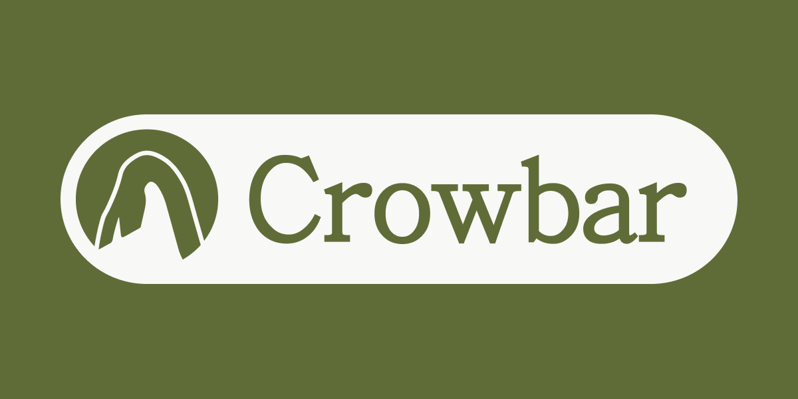

<p align="center">
  
  <br/>
  <em>The IDE where agents do the heavy lifting.</em>
</p>

Coding agents can now produce more code in an afternoon than anyone can carefully read, and the tooling around them has not kept up. They run loose in the working tree you are also using, or behind a web UI far from the repository they are editing; you are married to whichever vendor's CLI you happened to open; and the review that should decide whether any of it is good happens somewhere else entirely, in a browser tab, against a diff with no trace back to the conversation that produced it.

Crowbar is a local-first desktop IDE built around that gap. Import a repository and every branch becomes its own managed git worktree; start a chat and an agent goes to work inside one, in a real terminal you can watch and type into. Move that same conversation between Claude Code and Codex whenever one suits the task better. When it stops, the branch's review is already there — diff, inline comment threads, PR status — and nothing it did ever touched your own checkout. It runs entirely on your machine: one Go daemon, a React frontend, and a Tauri shell around them.

#### What's in this repo

Everything. `api/` is the Go daemon that owns worktrees, agent sessions, terminals, LSP and search; `web/` is the React frontend; `desktop/` is the Tauri shell that hosts it; `docker/` is the same daemon serving a prebuilt bundle for self-hosting. The daemon is the product — the desktop app is a window onto it, which is why the Docker image serves the identical thing with no desktop app involved.

#### What it does

- **Diff review** — every branch carries its own diff, inline comment threads and PR status.
- **Provider switching mid-conversation** — move a live chat between Claude Code and Codex freely.
- **Deterministic workflows** _(WIP)_ — repeatable, declaratively-defined agent runs.
- **And more yet to come.**

---

## Switch providers mid-conversation

Claude Code and Codex both run as first-class providers, and a chat is not bound to whichever one opened it. Switch mid-conversation and the outgoing CLI is asked to exit cleanly — so it flushes its own transcript instead of losing its last turn — while the incoming one picks the thread up in the same workspace. Providers can be enabled, disabled and prioritised globally, and each one reports whether it is actually installed on this machine.

That is possible because a provider is a YAML descriptor, not an integration. Everything Crowbar needs to know about a CLI — how to spawn it, how to resume a session, which hooks report progress — is declared in one file:

```yaml
id: claude
display_name: Claude

spawn:
  cmd: claude
  interactive_required: true
  # Every tool call routes through a hook, and Crowbar's own permission
  # level answers most of them in milliseconds — so the pane still feels
  # hands-off, but nothing runs on the CLI's own say-so.
  args: ["--permission-mode", "default"]

session:
  resume: { arg: "--resume {id}" }

hooks:
  format: json
  events:
    session_start: { session_id: session_id }
    user_prompt: { message: prompt }
```

Two descriptors ship today — `claude.yaml` and `codex.yaml`. In principle a third CLI is a third file; in practice only those two have been proven end to end, and each carries the sharp edges its vendor actually has (Codex, for instance, runs under a kernel sandbox that has to be handed back network access to reach its own hooks).

## Diff review

Every branch carries its own review: the diff, inline comment threads anchored to lines, and PR status — in the same window as the agent that wrote the code. Reading the work and going back to the agent about it is one motion instead of two tools and a browser tab.

## Deterministic workflows _(WIP)_

Not every task deserves a conversation. Workflows are declaratively-defined agent runs — same steps, same order, every time — for the work you would otherwise re-explain in prose on each attempt. This one is in progress, not shipped.

---

## Every branch is a worktree

Importing a repository provisions a managed worktree per branch, laid out by remote and branch name so the path tells you what it holds:

```
~/.crowbar/projects/<project>/github.com/acme/api/
├── main/worktree              # protected → locked, provisioned at import
├── develop/worktree           # protected → locked
└── feature/rate-limit/worktree
```

Protected branches are permanently checked out in their own locked worktree, so `develop` is always somewhere on disk in a known state. Everything else forks from **origin's** tip of its parent, not from whatever your local ref happens to be — a branch created at 9am does not silently start from yesterday's `develop`.

Agents only ever run inside a worktree. Two of them cannot tread on each other, and neither can reach the checkout you are working in.

## The terminal is a screen model, not a stream

The daemon runs the VT emulation itself and keeps an authoritative screen model per session; the frontend renders row diffs of that model. Terminals and agent chats therefore survive pane switches, workspace switches, and reloads of the whole webview — the session state was never in the browser to begin with. It also means an agent's PTY is a first-class object the daemon can reason about, rather than bytes flying past.

## The rest of the IDE

Monaco editor with LSP, project-wide search, file explorer, integrated terminals, git history and branch operations — import a branch that only exists on origin, rename a workspace and have git, disk and record move in lockstep. Markdown opens in a rich editor with a Source view a click away. Switching Crowbar's theme is pushed down to the sessions themselves, so a CLI running in a pane follows the app instead of staying dark against a light window.

## More to come

Stated plainly, because a README that blurs these is worthless:

- **Deterministic workflows** — in progress, as above.
- **Per-project review memory** — the thesis this is all pointed at: an agent reads the comments you leave on real reviews, extracts the principles behind them, and feeds those into future runs, so the reviewer starts catching what you catch and you review less over time.

Everything else described above ships today.

## Extending Crowbar, through Quiver

Crowbar already ships through Quiver. The next step is for the pieces Crowbar is _made of_ to travel the same way — published by anyone, installed by anyone, with no marketplace to be admitted to and no plugin API to be blessed into:

- **Provider descriptors.** Publish the YAML for any CLI and it runs beside the ones that ship, with the same chats, workspaces and mid-conversation switching. Provider-agnostic in the literal sense, rather than "we support the two we integrated".
- **Deterministic workflows.** Share a workflow the way you share a repository, and run someone else's without rebuilding it from a blog post.
- **LSP servers.** Language support as something you install, not something we bundled.
- **Themes.** Same story.

This is the direction, not the state: it waits on Quiver.

---

## Installing

Crowbar is distributed through [Quiver](https://github.com/rabbytesoftware/quiver.desktop), a decentralised package manager by the same author. Install it from the Quiver desktop app, or add it by namespace:

```
github.com/char2cs/crowbar
```

Builds are not code-signed yet, so macOS will ask you to confirm the first launch.

## Contributing

Crowbar is open-source and contributions are welcome. Building it needs Go, [Bun](https://bun.sh) and Rust.

| Command              | Description                                       |
| -------------------- | ------------------------------------------------- |
| `make dev`           | Daemon, web and desktop together, with hot reload |
| `make dev-desktop`   | Just the Tauri app                                |
| `make build`         | Web bundle, Go daemon, and desktop app            |
| `make test`          | api + web + desktop                               |
| `make lint`          | Lint everything                                   |
| `make test-coverage` | Tests with coverage reports                       |
| `make docker-up`     | Self-hosted daemon at `localhost:3737`            |

Before opening a PR, always run:

```bash
make pr-checks
```

That is lint, coverage and build — the same suite CI runs.

Every `dev` target roots Crowbar's state at `<repo>/.crowbar` instead of `~/.crowbar`, so a dev instance never collides with an installed one. Tests deliberately do not inherit that override.

---

## Naming

Crowbar follows the Valve-universe naming schema used across the rabbytesoftware ecosystem. The crowbar is Gordon Freeman's tool — simple, brutally effective, works in any environment, and the first thing you reach for. That is the right metaphor for a development tool.

---

## License

Crowbar is dual-licensed: [**AGPL-3.0**](LICENSE) or a **commercial license**.

Use it, modify it, self-host it — freely, under the AGPL. The catch is AGPL § 13: if you modify Crowbar and let others interact with it over a network, you have to publish your changes. Running it on your own machine for your own work triggers nothing. If that does not work for you, a commercial license removes the copyleft obligations — see [LICENSING.md](LICENSING.md).

Third-party components keep their own licenses; see [NOTICE.md](NOTICE.md).

---

## Stay Connected

- [Rabbyte GitHub](https://github.com/rabbytesoftware)
- [char2cs](https://char2cs.net)
