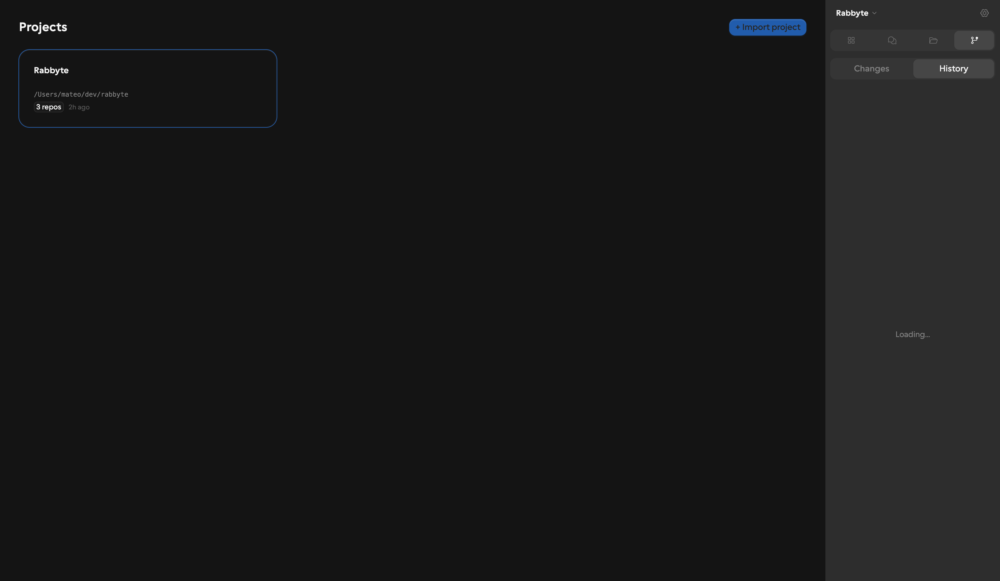
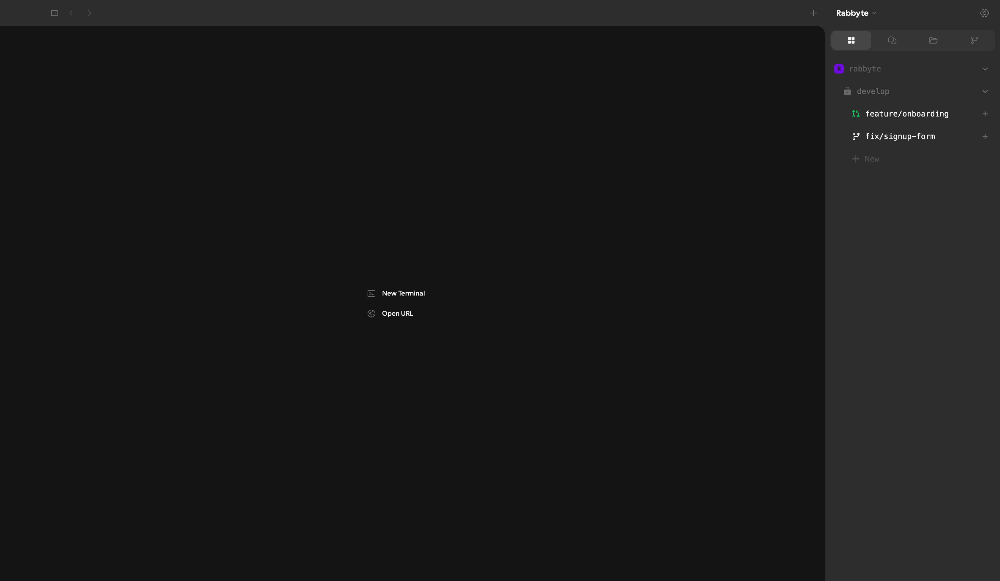
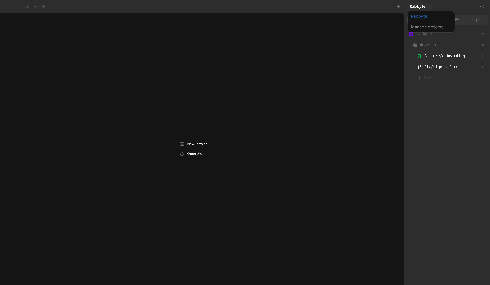
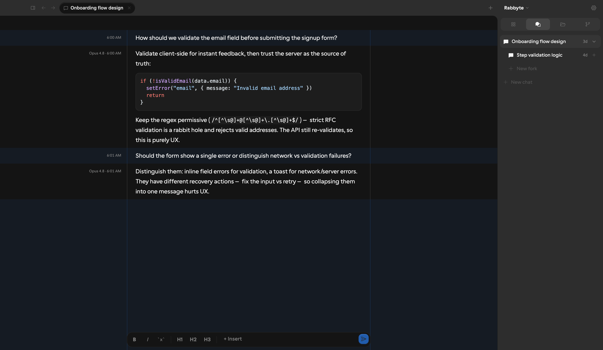
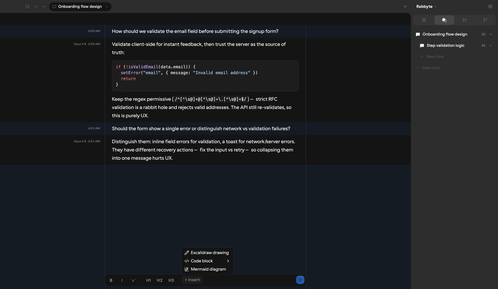
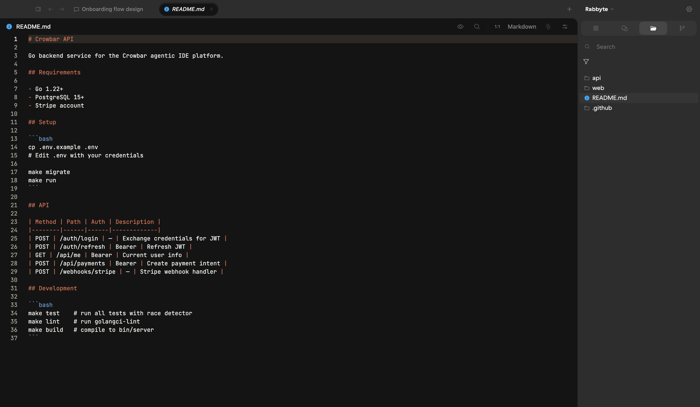
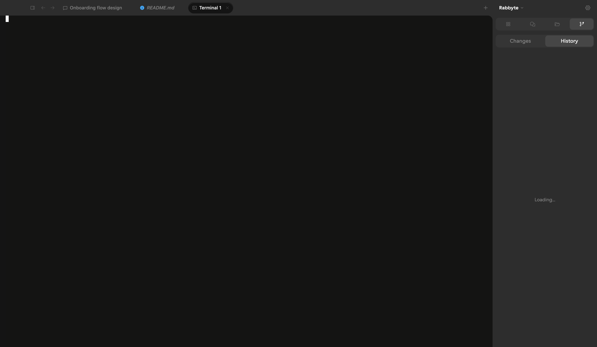
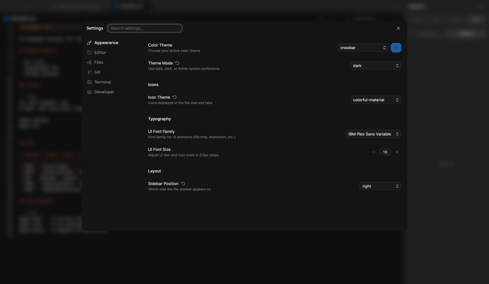

# Crowbar — Frontend Capability Requirements

> This document describes **what the frontend does and what it needs** to do it.  
> Written from the UI's point of view. No backend implementation is assumed.  
> Screenshots are in the same directory as this file (`docs/v0/`).

---

## How to read this

Each section covers one area of the application. Inside each section:

- **What the user sees / does** — the experience from the user's perspective
- **Data the UI needs to display** — shape of every piece of information rendered
- **Operations the user can trigger** — every write/mutation available
- **Real-time behavior** — anything that must update live without user action

---

## 1. Projects

The entry-point view. A project is a directory on disk that owns one or more git repositories.



**What the user sees:**
A grid of cards. Each card shows the project name, its path on disk, how many repos it contains, and how long ago it was last touched. There's a single call-to-action to import a new one.

**Data needed to display:**
```
Project {
  id: string
  name: string
  path: string          // absolute path on disk
  repoCount: number     // how many git repos live inside
  lastActivity: Date
}
```

**Operations:**
- Load all projects on page mount
- Import a project: provide a name + path on disk → project appears in the grid

---

## 2. Workspace Navigation (Sidebar — Workspaces Panel)





The primary navigation. Everything in the app lives inside a workspace. A workspace is a checkout of a specific git branch inside a repo. Workspaces nest under repos, and workspaces can be children of other workspaces (branch-off-branch).

**What the user sees:**
A tree: `Org name > Repo name > Base branch (locked) > Feature branch workspaces`. Each workspace row shows its branch name, a colored status badge, the net line count change (+340 -12), relative age, and a conflict indicator when present. A `+ New` inline input at the bottom of each repo's branches creates a new workspace by typing a branch name.

**Status badges the UI renders — all 6 must be real states:**
| Status | Meaning |
|--------|---------|
| `locked` | Base/protected branch — cannot be deleted |
| `new` | Just created, no commits yet |
| `pr-open` | A pull request is open for this branch |
| `pr-closed` | PR was closed without merging |
| `pr-merged` | PR has been merged |
| `agent-running` | An AI agent is currently executing in this workspace |

**Data needed to display:**
```
Repo {
  id: string
  name: string
  avatarLabel: string   // single char for the avatar badge
  avatarColor: string   // color class for the badge background
  workspaces: Workspace[]
}

Workspace {
  id: string
  branch: string
  parentId?: string       // for nested (fork-of-fork) workspaces
  status?: WorkspaceStatus
  added?: number          // +N lines in this branch vs. parent
  deleted?: number        // -N lines
  age: string             // "2d ago", "just now", etc.
  hasConflicts?: boolean
}
```

**Operations:**
- Load the full repo + workspace tree on app start
- Navigate to a workspace (click) — loads the workspace environment
- Create a workspace — type a branch name inline → workspace appears with `status: 'new'`
- Create a child workspace — click the `+` button on an existing workspace row → new workspace nested under it
- Delete a workspace — drag it to the "Drop to delete" zone. Children are deleted too, unless a child is `locked`

**Real-time behavior:**
The `+N -N` diff stats and `status` badge update live as work progresses in a workspace. The `agent-running` badge appears and disappears as agents start and stop. This cannot be a poll — it must push.

---

## 3. Workspace Environment

When the user navigates into a workspace, the main content area becomes an IDE-like environment: a split-pane canvas where each pane holds one or more tabs (buffers). The initial empty pane shows two quick-action buttons: "New Terminal" and "Open URL". A `+` button in the tab bar opens a dropdown with three options: **New Conversation** (opens a new chat as a `crowbarChat` tab), **New Terminal**, and **Open URL**.

### 3.1 The Pane System

**What the user does:**
- Open a file → creates a new Editor tab in the active pane
- Split the active pane horizontally or vertically — creates a second pane side by side
- Drag a tab from one pane to another
- Drag the divider between panes to resize the split
- Pin a tab (prevents auto-eviction when the tab limit is reached)
- Mark a tab as "preview" — it's replaced by the next opened file unless pinned
- Maximize a pane to fullscreen (then restore)
- Close a pane — its tabs redistribute or the pane collapses
- Undo a closed tab (reopen last closed)

**The 12 tab content types:**

| Type | What it shows |
|------|--------------|
| `editor` | Monaco code editor for a file |
| `terminal` | Full xterm.js terminal (PTY session) |
| `diff` | Git diff viewer (unified or split) |
| `crowbarChat` | AI agent conversation — this is how sidebar chats open in the main area (see §4/§5) |
| `webViewer` | Embedded browser (iframe with nav controls) |
| `markdownPreview` | Rendered markdown from an open `.md` file |
| `htmlPreview` | Rendered HTML from an open `.html` file |
| `csvPreview` | Sortable table from an open `.csv` file |
| `imagePreview` | Image centered with zoom controls (see §31) |
| `pdfPreview` | PDF rendered page by page (see §31) |
| `externalEditor` | Bridge to Vim/Helix over a terminal connection (see §30) |
| `newTab` | Empty start state with quick-action buttons |

No backend interaction for pane layout itself — it is pure local state, persisted to IndexedDB.

---

### 3.2 Workspace Metadata

When a workspace is navigated to, the app needs to resolve it to a `repoId` and a `branch` — the two pieces of context everything else (file tree, git status, terminal working directory) depends on.

**Data needed:**
```
WorkspacePayload {
  id: string
  repoId: string
  branch: string
}
```

---

## 4. Chat Threads (Sidebar — Chats Panel)



Every workspace has a list of AI conversations attached to it. **Opening a chat from the sidebar creates a `crowbarChat` pane in the main content area** — the sidebar and the pane are two views of the same entity. The sidebar shows the list and status; the pane shows the content and input. Chats form a **tree**: any chat can be forked into a new child session. A fork branches off a parent at a specific point in the conversation history — the child starts with the same context up to that point and continues independently from there. This is the primary way users explore different approaches without losing a prior line of reasoning.

The sidebar renders this tree with collapse/expand. A parent can have multiple forks, and forks can themselves be forked — the depth is unbounded.

**What the user sees:**
A tree of conversation titles. Parent chats show a collapse arrow when they have children. Each item shows its age and a spinner when `status: 'agent-running'`. Hovering a chat reveals a "Fork chat" button. Two creation actions exist at the bottom: `+ New fork` (child of the current thread) and `+ New chat` (root-level, unrelated conversation).

**Data needed:**
```
Chat {
  id: string
  wsId: string          // which workspace this belongs to
  title: string
  age: string           // relative time, e.g. "3d"
  parentId?: string     // set when this chat is a fork of another
  status: 'idle' | 'agent-running'
  type: 'chat' | 'workflow'
}
```

The tree is reconstructed client-side from `parentId` references. Root chats have no `parentId`. The order within a level is by creation time.

**Operations:**
- Load all chats for the active workspace (returns the flat list; tree is built client-side)
- Create a new root chat
- Fork a chat — creates a child with `parentId` set to the source chat's `id`, inheriting conversation history up to the fork point
- Rename a chat
- Delete a chat (drag to "Drop to delete")
- Open a chat → loads the full conversation history in the main area

**Real-time behavior:**
`status: 'agent-running'` must update live. A chat can transition from `idle` → `agent-running` at any moment when an agent is triggered, and back to `idle` when it finishes. The spinner in the sidebar is driven by this state.

---

## 5. Chat View (AI Conversation)




The main AI interaction surface. A scrollable history of turns alternating between user messages and agent responses, followed by a rich-text input at the bottom.

**What the user sees:**
- Past turns rendered as markdown (with syntax-highlighted code blocks, headings, lists, inline code)
- Each agent turn shows the model name (e.g. "Opus 4.8") and a timestamp
- An agent turn that is actively streaming shows a blinking cursor at the end
- A text input (CodeMirror editor) with a formatting toolbar: Bold, Italic, Inline code, H1/H2/H3, + Insert
- The "+ Insert" menu: Excalidraw drawing, Code block (with language selector), Mermaid diagram
- A Send button (⌘↵) and a Stop button (when streaming)

**Data needed — one turn:**
```
Turn {
  id: string
  role: 'user' | 'agent'
  content: string        // raw markdown
  timestamp: string      // ISO 8601
  authorName: string     // "Mateo" for user, model name for agent
  model?: string         // "Opus 4.8" — only on agent turns
  widgets: Widget[]      // embedded diagrams/drawings attached to this turn
  streaming?: boolean    // true while the agent is still typing
}

Widget {
  id: string
  type: 'excalidraw' | 'mermaid' | 'code'
  payload: unknown       // diagram JSON, mermaid source, code string
}
```

**Operations:**
- Load conversation history on chat open (all past turns)
- Send a message: user provides content + optional attached widgets → agent streams a response
- Stop a streaming response mid-flight
- Edit/interact with an embedded Excalidraw drawing inline (opens an editor, serializes back)
- Insert a Mermaid diagram that renders inline
- Insert a code block with syntax highlighting

**Real-time behavior — streaming:**
The response arrives as a stream. The agent turn starts empty with `streaming: true`. The backend sends incremental text deltas. Each delta is appended to the turn's content and the view re-renders. When the stream ends, `streaming` is set to `false` and the turn is finalized.

The streaming wire protocol the frontend expects:
```
// text delta
{ type: 'text', delta: string }

// embedded widget
{ type: 'widget', data: Widget }

// tool call (agent used a tool)
{ type: 'tool_call', name: string, args: object, status: 'pending'|'done'|'error', output?: unknown }

// end of stream
{ type: 'done' }
```

---

## 6. File Explorer (Sidebar — Files Panel)

A standard file tree for the workspace's repo. Files show git status decorations (modified = orange, added = green, deleted = red). A search/filter input at the top narrows the tree client-side.

**What the user sees:**
A tree of folders and files. Each file has an icon determined by its extension (via icon theme). Files with unsaved edits show a dot. Files with git changes show a colored indicator.

**Data needed — one node:**
```
FileNode {
  name: string
  path: string              // absolute path
  type: 'file' | 'directory'
  children?: FileNode[]     // present for directories (lazy or eager)
  gitStatus?: 'modified' | 'added' | 'deleted' | 'untracked' | 'renamed'
}
```

**Operations:**
- Load the file tree for the workspace's repo root
- Click a file → open it in an Editor tab (loads file content)
- Right-click → context menu: delete file, rename file (confirmation dialog for delete)
- Open all files in a folder → confirmation dialog when count > threshold

**Data needed — file content:**
```
FileContent {
  content: string       // UTF-8 text
  encoding?: string     // 'base64' for binary
}
```

---

## 7. Code Editor



Monaco editor embedded in an editor pane. Full IDE editing experience.

**What the user sees:**
Line numbers, syntax highlighting, inline git blame on the current line, gutter indicators for added/modified/deleted lines (git gutter), find/replace bar, minimap (optional), breadcrumb path.

**Operations the user performs:**

*Within the editor:*
- Type to edit
- Save (⌘S) — writes to disk, runs formatter if enabled, runs linter if enabled
- Save all (⌘⇧S) — saves every dirty buffer
- Find/replace (⌘F)
- Switch language mode
- Format document (via formatter)

*That require data from the backend:*
- Load file content — needed to populate the editor
- Save file content — user's edits must be written back to disk
- LSP completions — autocomplete suggestions, parameter hints (requires language server for the repo)
- LSP diagnostics — inline errors and warnings

**Data for display:**
- File content (UTF-8 text)
- Git blame per line:
  ```
  BlameEntry {
    lineNumber: number
    commitHash: string
    author: string
    email: string
    date: string
    commitMessage: string
  }
  ```
- Git gutter decorations (derived from diff between HEAD and working tree):
  - Added lines (green bar)
  - Modified lines (orange bar)
  - Deleted markers (triangles)

**Write operation:**
User saves → content is written back to the file at `path`. This is the most frequent write operation in the entire app.

---

## 8. Git Panel — Changes Tab

Shows the working tree status: which files have been modified, added, deleted, or renamed vs. HEAD. Staged and unstaged changes are shown separately.

**What the user sees:**
A file tree filtered to only changed files. Each file shows a colored status badge (M/A/D/R) and a staged/unstaged indicator. A search/filter at the top.

**Data needed:**
```
GitStatus {
  branch: string
  ahead: number     // commits ahead of upstream
  behind: number    // commits behind upstream
  files: GitFile[]
}

GitFile {
  path: string
  status: 'modified' | 'added' | 'deleted' | 'untracked' | 'renamed'
  staged: boolean
}
```

**Real-time behavior:**
The git status must update live as the user (or an agent) edits files. This is a push stream, not a poll. Every time a file changes on disk, the backend pushes a new `GitStatus` and the panel re-renders. The workspace sidebar's `+N -N` badges are also driven by this same stream.

**Operations:**
- Stage a file (move from unstaged → staged)
- Unstage a file
- Discard changes to a file (with confirmation dialog)
- Click a file → open its diff in a Diff tab
- Stage/unstage an individual hunk within a file diff

---

## 9. Git Panel — History Tab

A scrollable commit log for the current branch.

**What the user sees:**
A list of commits. Each row: commit hash (7 chars), message, author name, relative date. The list is paginated — scrolling to the bottom loads more.

**Data needed — one commit:**
```
Commit {
  hash: string        // full 40-char SHA
  shortHash: string   // 7-char abbreviation
  message: string
  description?: string  // extended body
  author: string
  email?: string
  date: string          // relative: "3 hours ago"
}
```

**Pagination:** the frontend loads 50 at a time using `limit` and `skip` (or `offset`) query params.

---

## 10. Git Diff Viewer

Opens in a Diff pane when the user clicks a changed file or a specific commit. Shows changes line by line with context.

**What the user sees:**
Either unified (single column, added=green, removed=red) or split (left=before, right=after) view. A header with file path, total +/- count, expand/collapse toggle. For image files: side-by-side image comparison. For binary files: "binary file changed" message.

**Data needed:**
```
FileDiff {
  file_path: string
  old_path?: string         // for renames
  new_path?: string
  is_new: boolean
  is_deleted: boolean
  is_renamed: boolean
  is_binary?: boolean
  is_image?: boolean
  old_blob_base64?: string  // for image diffs
  new_blob_base64?: string
  lines: DiffLine[]
  additions: number
  deletions: number
}

DiffLine {
  line_type: 'added' | 'removed' | 'context' | 'header'
  content: string
  old_line_number?: number
  new_line_number?: number
}
```

**Multi-file diff** (for branch-level diffs or commit diffs):
```
MultiFileDiff {
  commitHash?: string
  commitMessage?: string
  commitDescription?: string
  commitAuthor?: string
  commitDate?: string
  files: FileDiff[]
  totalFiles: number
  totalAdditions: number
  totalDeletions: number
}
```

**Operations:**
- Toggle unified / split view
- Expand / collapse individual files in a multi-file diff
- Stage / unstage individual hunks (in working-tree diffs)

---

## 11. Branch Review Panel

A dedicated review interface for a workspace's branch. It combines the diff, inline code-review threads, an AI-generated description, and a discussion sidebar. This is the "review before merge" surface.

**What the user sees:**
A tabbed panel with three subtabs:
- **About** — AI-generated description of what this branch does (markdown)
- **Git** — the commit diff for this branch (same diff viewer as §10)
- **Discussion** — inline comment threads anchored to specific lines in the diff

On the diff view, hovering a line shows a comment button. Clicking it opens an inline thread. Each thread has a chain of messages (user + agent), a resolve button, and an unresolved indicator.

A merge strategy selector (merge / squash / rebase) appears in the panel header.

**Data needed — branch overview:**
```
BranchReview {
  description: string          // AI-generated markdown summary of this branch
  mergeStrategy: 'merge' | 'squash' | 'rebase'
  diff: MultiFileDiff
  threads: ReviewThread[]
  conversations: BranchChat[]  // branch-scoped discussions (separate from workspace chats)
}

ReviewThread {
  id: string
  filePath: string
  lineNumber: number
  side: 'left' | 'right'       // which side of the diff
  isResolved: boolean
  messages: ReviewMessage[]
}

ReviewMessage {
  id: string
  author: string | null        // null = current user
  isAgent: boolean
  body: string                 // markdown
  createdAt: string            // ISO 8601
}

BranchChat {
  id: string
  title: string
  age: string
  isActive: boolean
}
```

**Operations:**
- Load the branch review data (description + diff + threads)
- Post an inline comment on a specific diff line
- Reply to an existing thread
- Resolve or reopen a thread
- Select merge strategy
- Start a new branch-scoped discussion
- Open a pull request when the branch has commits ahead of its base (see §23)

---

## 12. Terminal



A full PTY terminal embedded in a tab. Multiple terminals can be open simultaneously in separate tabs or panes.

**What the user sees:**
A full-featured terminal emulator. Accurate color support (256/truecolor), bold/italic/underline rendering, proper cursor rendering. Find-in-buffer search overlay (⌘F). Zoom control (⌘+ / ⌘-).

**Session lifecycle:**
1. User opens a new terminal tab
2. A PTY session is created (backend spawns a shell process)
3. A bidirectional stream is established between the xterm renderer and the PTY
4. Resizing the pane triggers SIGWINCH to the PTY

**Wire protocol (terminal ↔ PTY):**
```
// Client → server (user typed / pasted)
{ data: string }

// Client → server (pane resized)
{ type: 'resize', cols: number, rows: number }

// Server → client (shell output)
{ sessionId: string, data: string, isInput: false }
```

**User interactions that go to the PTY:**
- Every keystroke
- Clipboard paste (with confirmation for multi-line pastes: shows "X lines — paste?")
- File drag-drop (inserts the file path as text at the cursor)

**User interactions that stay client-side:**
- Zoom in/out (changes font size in xterm, no backend involvement)
- Find (searches the terminal scrollback buffer locally)
- Select + copy (clipboard, local)
- Click hyperlinks detected in output

**Terminal settings that affect rendering (client-only):**
- Font family, size, line height, letter spacing
- Scrollback buffer size (how many lines to keep in memory)
- Cursor style (block / underline / bar), blink, width
- Color scheme / theme

---

## 13. Web Viewer

An embedded browser tab within a pane. Useful for previewing running web servers, documentation, or design tools.

**What the user sees:**
An iframe with a minimal browser chrome: back/forward buttons, URL bar, reload. Zoom level control.

**Operations:**
- Navigate to a URL (typed into the URL bar or opened from the "Open URL" action)
- Navigate back/forward in the iframe's history
- Reload
- Adjust zoom level

No backend involvement — the iframe renders URLs directly.

---

## 14. Settings



A modal dialog with search and six tabs. All settings persist client-side (IndexedDB + localStorage). No backend involved today, but multi-device sync would require a backend in the future.

**Settings the user can change (selected highlights):**

*Appearance:*
- Color theme (dropdown, supports custom theme upload)
- Theme mode: light / dark / follow system
- Icon theme
- UI font family + size
- Sidebar position (left / right)

*Editor:*
- Font family, size, line height, tab size
- Word wrap, line numbers, indent guides, minimap, whitespace markers
- Auto-save, format on save, lint on save
- Auto-completion, parameter hints

*Terminal:*
- Default shell
- Terminal profiles (name, shell override, startup commands, working directory)
- Font family, size, line height, letter spacing
- Scrollback size
- Cursor style + blink

*Git:*
- Diff view default (unified / split)
- Show git status in file tree
- Inline git blame toggle
- Git gutter toggle
- Open diff on click toggle

*Keybindings:*
- Preset: VS Code / JetBrains / Sublime / Xcode / Atom / Emacs / Zed

**Import / Export:**
The Developer settings tab exposes two actions:
- **Export settings** — serialises all current settings to a JSON file the user can save
- **Import settings** — accepts a JSON file and applies all settings atomically. Invalid keys are ignored; valid ones take effect immediately.

No backend required — settings live entirely client-side.

---

## 15. Workspace Sidebar — Structure & Interactions

The sidebar is a fixed-width panel (resizable by dragging) on the right side. It contains a tab bar with 4 tabs; switching tabs scrolls a horizontal carousel of panels. The active tab is persisted.

**Drag-to-delete zone:**
Both workspaces and chats have a "Drop to delete" target at the bottom of their lists. Dragging an item there triggers a delete. For workspaces: cascade deletes children (skipping `locked` ones). For chats: single delete.

**Collapsible sections:**
Repos, workspaces, and chat threads can all be individually expanded/collapsed. Collapsed state is persisted.

---

## 16. Command Palette

Opened with ⌘P (quick-open) or ⌘⇧P (command palette). A searchable overlay of every action available in the current context.

**Action categories (user-facing):**
- Open file (quick fuzzy search across file tree)
- Go to line / symbol in current file
- Git: stage, unstage, commit, branch switch, pull, push, fetch, stash, reset, rebase, merge
- Terminal: new terminal, split, kill, clear, focus
- View: toggle sidebar, toggle bottom pane, focus git panel
- Settings: open specific settings tab
- Window: zoom, fullscreen

No backend involvement — all actions dispatch to the appropriate store.

---

## 17. Real-Time Summary

These are the live behaviors the frontend expects — things that update without the user doing anything:

| What updates | Trigger | Frequency |
|---|---|---|
| Workspace `+N -N` diff stats | Agent/user commits code | Event-driven |
| Workspace `agent-running` badge | Agent starts/stops | Event-driven |
| Workspace `pr-open/merged/closed` status | PR submitted or merged | Event-driven |
| Workspace `hasConflicts` flag | Merge/rebase conflict introduced or resolved | Event-driven |
| Git Changes panel | Any file write on disk | Event-driven (filesystem watch) |
| Open editor tab content | Agent writes the file currently open | Event-driven (file watcher, §27) |
| File tree structure | Agent creates/deletes/renames files | Event-driven (file watcher, §27) |
| Chat `agent-running` spinner | Agent starts/stops | Event-driven |
| Agent chat response | User submits message | Streamed, per-token |
| Agent tool call status | Tool completes or errors | Event-driven within stream |
| Terminal output | Shell produces output | Streamed, continuous |

All real-time updates must be **push** (WebSocket or SSE). Polling would produce visible lag in the terminal and chat streaming, and would miss filesystem events between polls.

---

## 18. Session Persistence (Client-Only)

The frontend persists a significant amount of state locally so sessions survive refresh:

| What | Where | Contents |
|------|-------|---------|
| Workspace pane layout | IndexedDB | Which panes exist, their sizes, split directions |
| Open editor buffers | IndexedDB | File paths, cursor positions, fold state, scroll position |
| Terminal sessions | Memory (per session) | Session ID, working directory |
| Recent files | IndexedDB | Last 50 opened files with timestamps |
| Sidebar collapse state | localStorage | Which repos/workspaces/chats are collapsed |
| Sidebar width | localStorage | Pixel width |
| Settings | IndexedDB | All 100+ settings values |
| Active sidebar tab | Zustand (in-memory) | 'workspaces'\|'chats'\|'files'\|'git' |

On app load, IndexedDB is hydrated before the UI renders (`HydrationGate`). This means the user sees their previous editor layout immediately, without a blank flash.

---

## 19. Data Dependency Map

This shows what data one capability depends on from another:

```
Project list
  └─ imports create a Project
       └─ a Project contains Repos
            └─ a Repo contains Workspaces
                 ├─ a Workspace has a file tree (root path)
                 │    └─ files can be searched across (Global Search §25)
                 ├─ a Workspace has a git repo (repo path)
                 │    ├─ git status / history / branches / stashes
                 │    └─ file watcher pushes changes from disk (§27)
                 ├─ a Workspace has Chats (tree via parentId)
                 │    └─ a Chat has Turns (conversation history)
                 │         ├─ a Turn may have Widgets (excalidraw/mermaid)
                 │         └─ a Turn may have Tool Calls (agent actions §28)
                 ├─ a Workspace has a Branch Review
                 │    ├─ Branch Review has a Diff (MultiFileDiff)
                 │    ├─ Branch Review has Threads (ReviewThread[])
                 │    └─ Branch Review can produce a Pull Request (§23)
                 │         └─ a Pull Request drives workspace status (pr-open/merged/closed)
                 └─ a Workspace can run Terminals (PTY sessions, with Profiles §29)
```

The `wsId` is the shared key that ties everything together. Every data fetch in the workspace context is scoped by `wsId`.

---

## 20. Edge Cases the UI Already Handles

These states are already wired in the frontend — the backend must produce them:

| State | How it's shown |
|-------|---------------|
| Empty chat history | Blank conversation area with input ready |
| Streaming in progress | Agent turn shows blinking cursor, Stop button active |
| Git history still loading | "Loading…" text in History tab |
| Git changes empty | "No folder open" with Open Folder button |
| No chats in workspace | Just "+ New chat" and "+ New fork" buttons |
| Workspace conflicts | `hasConflicts: true` adds a conflict indicator to the sidebar row |
| Workspace locked | Delete action does nothing; item is skipped in cascade delete |
| File tree empty | No items in explorer (empty directory) |
| Binary/image file in diff | Special image diff renderer or "binary file" message |
| Large paste in terminal | Confirmation dialog: "Paste N lines?" |
| Too many open tabs | Oldest unpinned tab auto-evicted when `maxOpenTabs` is hit |
| Pane with no buffers | Pane closes automatically |
| Unsaved changes on close | Confirmation dialog: Save / Discard / Cancel |
| Merge conflicts present | Conflict badge in Changes panel; conflict resolution mode opens in diff viewer (§24) |
| Agent tool call failed | Error state shown in the tool call pill within the agent turn |
| LSP server not running | No completions or diagnostics; status indicator in the editor toolbar shows the inactive state |
| File changed on disk while open with unsaved edits | Prompt: "File changed externally — reload or keep your changes?" |
| All conflicts resolved | `hasConflicts` clears on the workspace row; Changes panel shows files as staged |

---

## 21. File Mutations

The file explorer and editor both expose write operations that modify the filesystem. These are distinct from saving file *content* (§7) — they change the structure of the tree itself.

**Operations:**
- **New file** — right-click a folder → "New File" → inline name input → file created and opened in an editor tab
- **New folder** — right-click a folder → "New Folder" → inline name input → folder appears in tree
- **Rename** — right-click a file or folder → "Rename" → inline name input → path updated everywhere (open tabs referencing the old path must be re-pointed)
- **Move** — drag a file/folder to a new location in the tree → path updated
- **Delete** — right-click → "Delete" → confirmation dialog → file removed from tree and any open tab for it is closed

**Data needed:** just the path and (for rename/move) the new path. No special shape.

---

## 22. Git Write Operations

The git panel and command palette expose a full set of write operations. The UI for these exists — inputs, confirmation dialogs, strategy selectors — but all require a backend to execute against the real git repo.

### Commit
- User stages files (§8), then opens a commit panel
- Types a commit message (subject + optional body)
- Commits staged changes → new commit appears at the top of History

### Push / Pull / Fetch
- **Push** — send local commits to the remote branch
- **Pull** — fetch + merge/rebase remote commits into the current branch
- **Fetch** — update remote-tracking refs without merging
- All three update the `ahead` / `behind` counters shown in the git status

### Branch Operations
A branch management panel (already exists in the UI) supports:
- **Create branch** — name input + optional source branch → new branch checked out
- **Switch branch** — click a branch in the list → workspace re-points to new branch, file tree and git status refresh
- **Rename branch** — inline rename input
- **Delete branch** — confirmation dialog (blocked if current branch)

**Data needed:**
```
Branch {
  name: string
  isCurrent: boolean
  isRemote: boolean
  ahead?: number
  behind?: number
  lastCommitDate?: string
}
```

### Stash Operations
A stash panel lists stashes and supports:
- **Stash** — optionally with a message → current changes saved to stash stack
- **Pop / Apply** — restore a stash (pop removes it from the stack, apply keeps it)
- **Drop** — delete a stash entry

**Data needed:**
```
Stash {
  id: string      // e.g. "stash@{0}"
  message: string
  date: string
  filesChanged: number
}
```

### Reset
- **Soft reset** — move HEAD back N commits, keep changes staged
- **Mixed reset** — move HEAD back, unstage changes
- **Hard reset** — move HEAD back, discard all changes (confirmation dialog)

### Merge / Rebase
- **Merge** — merge a selected branch into the current branch
- **Rebase** — rebase the current branch onto a selected branch
- Both operations may result in conflicts, which surface as `hasConflicts: true` on the workspace and a conflict resolution UI in the diff viewer

### Worktree Management
A worktree panel (already in the UI) lets users:
- Create a new git worktree for a branch (maps to a `Workspace` in Crowbar's model)
- Switch active worktree
- Delete a worktree

---

## 23. Pull Request Creation

A workspace whose branch has commits ahead of its parent can submit a pull request. This transitions the workspace status from `new` → `pr-open`. The flow lives inside the branch review panel (§11).

**What the user sees:**
When no PR is open for the current branch, the branch review panel shows a "Open Pull Request" action. Clicking it expands a form:
- **Title** — pre-filled from the last commit message, editable
- **Description** — pre-filled from the AI-generated branch description (§11), editable markdown
- **Base branch** — the target branch to merge into (defaults to the workspace's `parentId` branch)
- **Merge strategy** — merge / squash / rebase selector (already in the panel header)
- A **Submit** button

After submission, the workspace row in the sidebar updates to `pr-open` and shows a link to the PR.

**Data needed to submit:**
```
PullRequestDraft {
  title: string
  description: string       // markdown
  sourceBranch: string      // the workspace's branch
  targetBranch: string      // the base branch
  mergeStrategy: 'merge' | 'squash' | 'rebase'
}
```

**Result:**
```
PullRequest {
  id: string
  url?: string              // link to external PR if hosted on GitHub/GitLab
  status: 'open' | 'closed' | 'merged'
  title: string
  targetBranch: string
  mergeStrategy: 'merge' | 'squash' | 'rebase'
  createdAt: string
}
```

Once a PR exists, the branch review panel switches to showing the PR status, thread discussion, and a **Merge** button. Merging updates the workspace status to `pr-merged`.

---

## 24. Merge Conflict Resolution

When a merge, rebase, or pull results in conflicts, the workspace status becomes `hasConflicts: true`. The sidebar shows a conflict indicator on the workspace row. The user must resolve conflicts before they can commit or merge.

**What the user sees:**
The git Changes panel highlights conflicting files with a special "conflict" badge. Clicking a conflicting file opens it in the diff viewer in **conflict resolution mode**:
- The file content shows the standard conflict markers (`<<<<<<<`, `=======`, `>>>>>>>`)
- The diff viewer renders these as a three-way view: **Ours** (current branch), **Base** (common ancestor), **Theirs** (incoming branch)
- For each conflict hunk, the user can:
  - Accept **ours**
  - Accept **theirs**
  - Accept **both** (concatenates both sides)
  - Manually edit the merged result in the editor

**Per-hunk resolution state:**
```
ConflictHunk {
  id: string
  startLine: number
  endLine: number
  ours: string        // current branch content
  theirs: string      // incoming branch content
  base?: string       // common ancestor (for 3-way merge)
  resolution: 'ours' | 'theirs' | 'both' | 'custom' | 'unresolved'
  resolvedContent?: string   // set when resolution is 'custom'
}
```

Once all hunks in a file are resolved, the file is marked as resolved and can be staged. Once all conflicting files are resolved and staged, the user can complete the merge commit.

**Real-time behavior:** `hasConflicts` on the workspace must update when conflicts are introduced or resolved so the sidebar indicator stays accurate.

---

## 25. Global Search

A full-text search overlay across all files in the workspace repo. Opened with ⌘⇧F or via the command palette.

**What the user sees:**
A panel with a text input and results grouped by file. Each result shows the file path, a matching line excerpt with the query highlighted, and the line number. Clicking a result opens the file in an editor tab at that line.

**Options the user can toggle:**
- Case-sensitive / case-insensitive
- Whole word match
- Regular expression mode
- Include/exclude glob patterns (e.g. exclude `node_modules/**`)

**Data needed per result:**
```
SearchResult {
  filePath: string
  lineNumber: number
  lineText: string        // the full matching line
  matchStart: number      // character offset of match start
  matchEnd: number        // character offset of match end
}
```

**Operations:**
- Search as the user types (debounced)
- Replace — optionally replace all matches in a file or across all files

---

## 26. Language Server Protocol (LSP)

The editor has full LSP client infrastructure wired in. The features below are already hooked up in the Monaco editor — they just need a language server running for the workspace's language(s).

**Go to definition** — ⌘Click or F12 on a symbol → opens the file at the definition. If the definition is in an external library, shows a read-only "peeked" view.

**Find all references** — right-click → "Find References" → opens a results panel listing every usage of the symbol across the codebase, grouped by file.

**Rename symbol** — F2 on a symbol → inline rename input → all usages across the project are updated atomically when confirmed.

**Hover documentation** — hovering a symbol shows a tooltip with its type signature and JSDoc/docstring.

**Code actions / quick fixes** — a lightbulb icon appears on lines with a suggested fix. Clicking it shows a list of available actions (import missing symbol, fix lint error, extract variable, etc.).

**Diagnostics (errors and warnings)** — squiggly underlines in the editor. A diagnostics panel (Problems view) lists all current errors and warnings across open files, with file path, line, and message. Clicking an entry navigates to the relevant line.

**Signature help** — while typing a function call, a tooltip shows the function's parameters with the currently active one highlighted.

**Data the LSP produces (shapes the editor consumes):**

```
Diagnostic {
  filePath: string
  range: { start: Position; end: Position }
  severity: 'error' | 'warning' | 'info' | 'hint'
  message: string
  source?: string    // e.g. "eslint", "typescript"
  code?: string | number
}

Position { line: number; character: number }
```

---

## 27. File Watcher (Live Disk Updates)

When an agent (or any external process) writes files on disk, the editor and file tree need to update without the user doing anything. The workspace store has a `fileWatcherSlice` for exactly this purpose.

**What must update automatically when a file changes on disk:**
- **File tree** — new files appear, deleted files disappear, renamed files update their name
- **Open editor tabs** — if the file is open and the on-disk content differs from the buffer content, the editor reloads it (or prompts the user if the buffer has unsaved changes)
- **Git status panel** — file changes trigger a git status refresh
- **Dirty indicators** — tabs showing a dot for unsaved changes must stay accurate

This is the primary mechanism by which the agent's work becomes visible in real time. The agent writes a file → watcher fires → editor tab updates → user sees the result immediately without switching away or refreshing.

**Real-time behavior:** The backend must push file change events over a persistent connection. The frontend subscribes per-workspace with the repo root path.

```
FileChangeEvent {
  type: 'created' | 'modified' | 'deleted' | 'renamed'
  path: string
  newPath?: string    // only for 'renamed'
}
```

---

## 28. Agent Capabilities (Tool Use)

The chat view streams `tool_call` events from the agent. These represent actions the agent takes *inside* the workspace on the user's behalf. The UI renders each tool call as a collapsible pill in the agent turn showing the tool name, arguments, and result.

**What the frontend expects the agent to be able to do:**

| Tool | What it does | UI representation |
|------|-------------|-------------------|
| `read_file` | Read a file's content | "Reading `src/foo.ts`" pill |
| `write_file` | Write content to a file | "Writing `src/foo.ts`" pill → triggers file watcher |
| `list_directory` | List files in a folder | "Listing `src/`" pill |
| `run_command` | Execute a shell command in the workspace terminal | Command output streams into a terminal buffer |
| `search_files` | Search for a pattern across the codebase | "Searching for `useAuth`" pill with result count |
| `git_status` | Read current git status | Internal, may not show pill |
| `git_diff` | Read a file diff | Internal |
| `git_commit` | Create a commit | "Committing: feat: add X" pill |

**Wire protocol** (the `tool_call` frame in the chat stream):
```
{
  type: 'tool_call'
  name: string                              // tool name e.g. "write_file"
  args: object                              // tool-specific arguments
  status: 'pending' | 'done' | 'error'
  output?: unknown                          // result after completion
}
```

The UI renders a `pending` tool call with a spinner. When the status becomes `done` or `error`, the pill updates. Multiple tool calls can be in flight simultaneously within a single agent turn.

---

## 29. Terminal Profiles

When opening a new terminal tab, the user can choose which terminal profile to use. Profiles are configured in Settings → Terminal and define a shell override, starting directory, and optional startup commands.

**What the user sees when opening a terminal:**
If more than one profile exists, a picker appears (dropdown or modal) showing profile names. The default profile is pre-selected. Selecting a profile and confirming opens the terminal with that configuration.

**Data needed:**
```
TerminalProfile {
  id: string
  name: string
  shell?: string              // e.g. "/bin/zsh", "/usr/bin/fish"
  startupDirectory?: string   // working directory override
  startupCommands?: string[]  // commands run immediately on connect
  icon?: string
  color?: string
}
```

The selected `profileId` is passed when creating a terminal session so the backend knows which shell/directory to use.

---

## 30. External Editor Bridge

`externalEditor` is one of the 12 pane tab types. It opens a file in an external terminal-based editor (Vim, Helix, Neovim) inside a terminal pane, via a remote connection.

**What the user sees:**
A terminal pane running the external editor process. The tab shows the file name. Saving inside the editor writes the file to disk, which triggers the file watcher (§27) and updates any other open editor tabs for that file.

**What this requires:**
- A terminal session (same as §12) — the external editor runs inside a PTY
- A connection ID linking the terminal to the buffer so the tab title and dirty state stay in sync

---

## 31. Preview Panes

Five additional pane content types render file content as a rich preview rather than raw text. All are read-only and require the file content to already be loaded.

| Tab type | Triggered by | What it shows |
|----------|-------------|---------------|
| `markdownPreview` | Opening a `.md` file in preview mode | Rendered markdown with headings, images, links, code blocks |
| `htmlPreview` | Opening a `.html` file in preview mode | Rendered HTML in an iframe sandbox |
| `csvPreview` | Opening a `.csv` file | Sortable/scrollable table with column headers |
| `imagePreview` | Opening any image file | Image centered in the pane with zoom controls |
| `pdfPreview` | Opening a `.pdf` file | PDF rendered page by page |

**Data needed:** raw file content (same as §6 file content). The rendering is entirely client-side. No additional backend capability is required beyond serving the file bytes.

---

*Produced by: live app visual capture + exhaustive source code analysis of `/web/src`*
